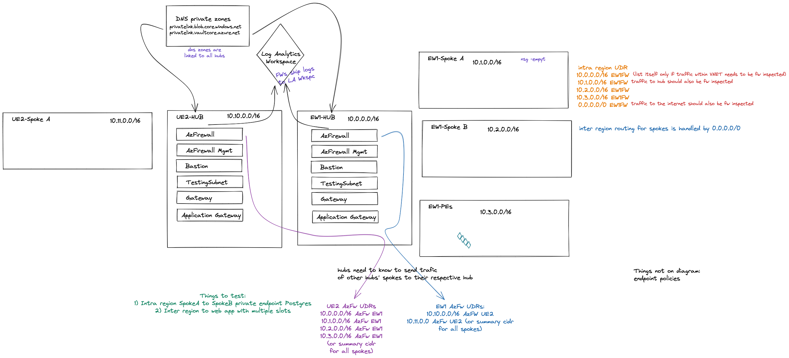
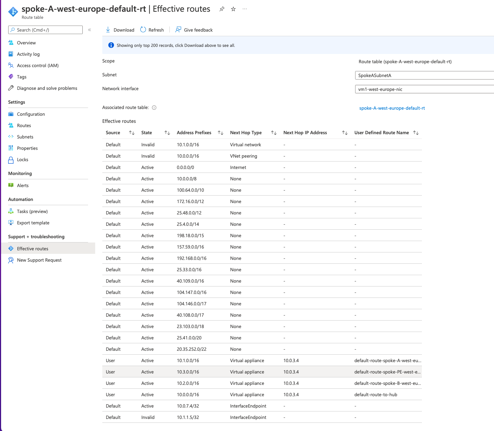

# AzureInterRegionalRoutingLab
The goal of this repo is to showcase a couple of InterRegion routing usecases.



# Goals
Create a lab environment that can be used for demonstrating cross region traffic flow.

# Prerequisites
* Terraform
* Terragrunt
* Azure Account with RG and SA

# Terragrunt
## applying whole region or subscription
This should be done only the first time around. Once the whole infra is deployed future changes are to be applied single module at a time
```
cd terragrunt/subscription/eu-west-1
terragrunt run-all apply
```
## applying single module
```
cd terragrunt/subscription/us-east-2/az-fw/terragrunt.hcl
terragrunt apply
```

## Terragrunt folder structure
```
terragrunt (root folder for TG. Contains a config file and one or more "subscriptions")
├── terragrunt.hcl (Defines providers and backends)
└── subscription (subscriptions contain a config file and one or more "regions")
    ├── subscription.hcl (subscription level vars)
    ├── eu-west-1 (regions contain individual terraform module deployments)
    │   ├── region.hcl (region level vars)
    │   ├── az-fw
    │   │   └── terragrunt.hcl (terraform deployment vars and dependencies on other deployments)
    │   └── hub-and-spoke
    │       └── terragrunt.hcl
    └── us-east-2
        ├── region.hcl
        ├── az-fw
        │   └── terragrunt.hcl
        └── hub-and-spoke
            └── terragrunt.hcl
```

# Azure
Private endpoints finallly have NSG and UDR support
https://azure.microsoft.com/en-us/updates/general-availability-of-network-security-groups-support-for-private-endpoints/
https://azure.microsoft.com/en-us/updates/general-availability-of-user-defined-routes-support-for-private-endpoints/

Unfortunatelly, terraform configuration renamed some of the api properties to make them more confusing:
https://github.com/hashicorp/terraform-provider-azurerm/issues/6334

`enforce_private_link_endpoint_network_policies` needs to be set to `false` in order for the provider to set `PrivateEndpointNetworkPolicies: Enabled`

# How PrivateEndpointNetworkPolicies: Enabled works
When this setting is enabled on a subnet. All private endpoints in that subnet will have their routes potentially invalidated in that AND all other subnets (if the right override rule exists). 

In case a subnet has this setting enabled and /32 has been injected from a PE in a peered subnet that doesn't have it enabled. The route will NOT override.
This could be phrased as: PrivateEndpointNetworkPolicies affects only the private endpoint /32 routes that are created from private endpoints coming from subnets with this setting enabled.


for context on the above screenshot:
* 10.0.0.0/16 - this vnet has PrivateEndpointNetworkPolicies: Enabled (false passed to terraform)
* 10.1.0.0/16 - this vnet has PrivateEndpointNetworkPolicies: Disabled (true passed to terraform)

On the screenshot above we can see that only one InterfaceEndpoint has been invalidated (very bottom of the list). Notice that routes exist for overriding both of them, but only one is working. This is because the setting affects all private endpoint interface routes (in whichever vnet they are created) of private endpoint that exist in the subnet, but doesn't work on private endpoint interface routes from other subnets.

# Important sources that teach important lessons
I would like to dearly thank all sources.
1. https://gaunacode.com/using-terragrunt-to-deploy-to-azure #terragrunt azure introduction
3. https://www.youtube.com/watch?v=LuKYu9ASGyo #terragrunt introduction
4. https://journeyofthegeek.com #many blog posts from this guy showcase many usecases in azure networking
5. https://cloudnetsec.blogspot.com/2019/02/azure-intra-region-and-inter-region.html # especially important blog post 

# Places I've stolen code snippets from:
6. https://jeffreyjblanchard.medium.com/azure-private-endpoints-and-terraform-85450fe9861c # deploying a KV
2. https://faizanbashir.me/building-an-nginx-webserver-on-azure-using-terraform #deploying a VM in azureWe
3. https://www.daveperrett.com/articles/2021/08/19/nested-for-each-with-terraform/