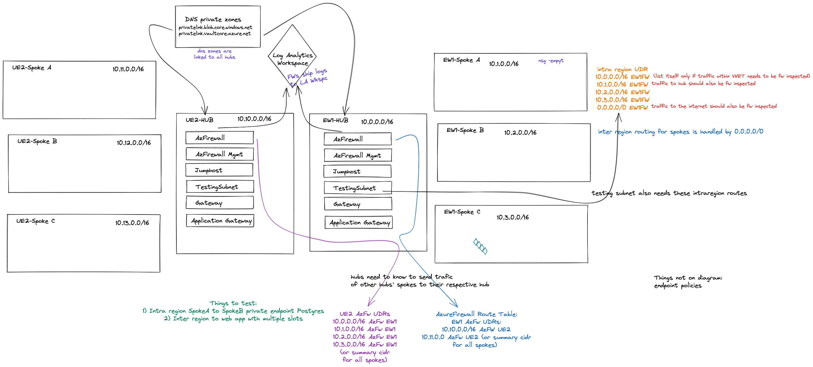

# AzureInterRegionalRoutingLab
The goal of this repo is to showcase a couple of InterRegion routing usecases. Determining the right route table entries can be tricky at times, hence why the lab was created.

# Sources
1. https://gaunacode.com/using-terragrunt-to-deploy-to-azure#comments-list

